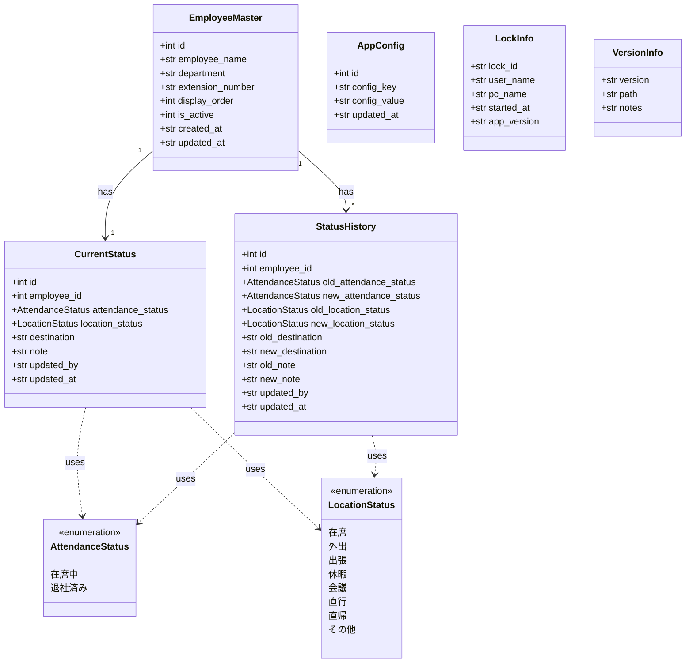
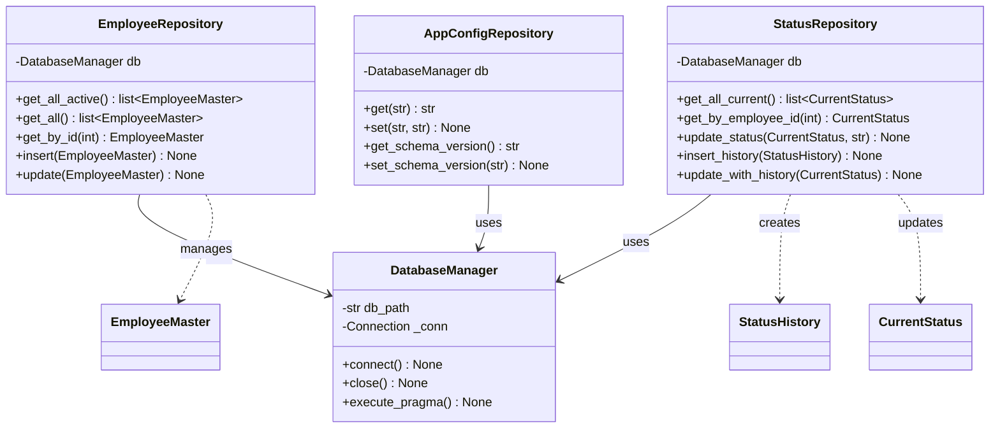
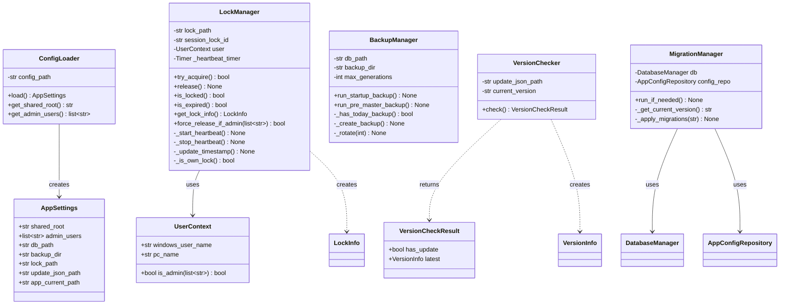
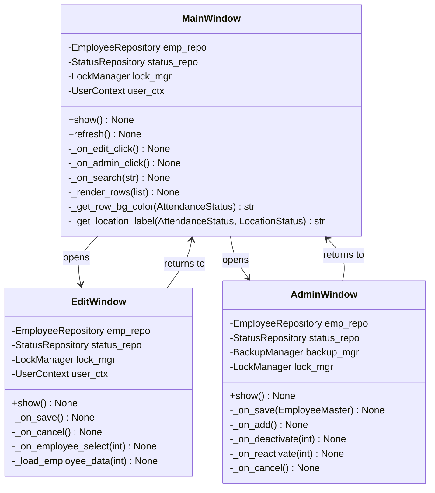
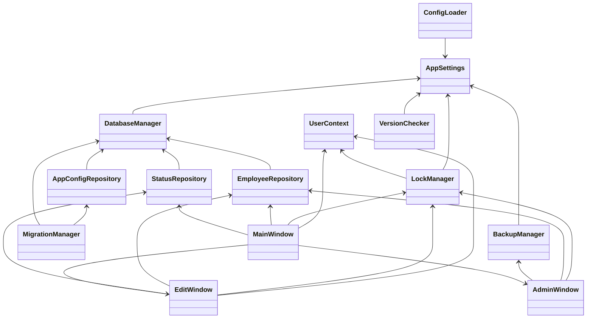

# CLASS.md

# クラス図

---

## 1. ドメインモデル（DBテーブル対応）

```mermaid
classDiagram
    class EmployeeMaster {
        +int id
        +str employee_name
        +str department
        +str extension_number
        +int display_order
        +int is_active
        +str created_at
        +str updated_at
    }

    class CurrentStatus {
        +int id
        +int employee_id
        +AttendanceStatus attendance_status
        +LocationStatus location_status
        +str destination
        +str note
        +str updated_by
        +str updated_at
    }

    class StatusHistory {
        +int id
        +int employee_id
        +AttendanceStatus old_attendance_status
        +AttendanceStatus new_attendance_status
        +LocationStatus old_location_status
        +LocationStatus new_location_status
        +str old_destination
        +str new_destination
        +str old_note
        +str new_note
        +str updated_by
        +str updated_at
    }

    class AppConfig {
        +int id
        +str config_key
        +str config_value
        +str updated_at
    }

    class LockInfo {
        +str lock_id
        +str user_name
        +str pc_name
        +str started_at
        +str app_version
    }

    class VersionInfo {
        +str version
        +str path
        +str notes
    }

    class AttendanceStatus {
        <<enumeration>>
        在席中
        退社済み
    }

    class LocationStatus {
        <<enumeration>>
        在席
        外出
        出張
        休暇
        会議
        直行
        直帰
        その他
    }

    EmployeeMaster "1" --> "1" CurrentStatus : has
    EmployeeMaster "1" --> "*" StatusHistory : has
    CurrentStatus ..> AttendanceStatus : uses
    CurrentStatus ..> LocationStatus : uses
    StatusHistory ..> AttendanceStatus : uses
    StatusHistory ..> LocationStatus : uses
```

---

## 2. データアクセス層

```mermaid
classDiagram
    class DatabaseManager {
        -str db_path
        -Connection _conn
        +connect() None
        +close() None
        +execute_pragma() None
    }

    class EmployeeRepository {
        -DatabaseManager db
        +get_all_active() list~EmployeeMaster~
        +get_all() list~EmployeeMaster~
        +get_by_id(int) EmployeeMaster
        +insert(EmployeeMaster) None
        +update(EmployeeMaster) None
    }

    class StatusRepository {
        -DatabaseManager db
        +get_all_current() list~CurrentStatus~
        +get_by_employee_id(int) CurrentStatus
        +update_status(CurrentStatus, str) None
        +insert_history(StatusHistory) None
        +update_with_history(CurrentStatus) None
    }

    class AppConfigRepository {
        -DatabaseManager db
        +get(str) str
        +set(str, str) None
        +get_schema_version() str
        +set_schema_version(str) None
    }

    EmployeeRepository --> DatabaseManager : uses
    StatusRepository --> DatabaseManager : uses
    AppConfigRepository --> DatabaseManager : uses
    StatusRepository ..> StatusHistory : creates
    StatusRepository ..> CurrentStatus : updates
    EmployeeRepository ..> EmployeeMaster : manages
```

---

## 3. サービス層

```mermaid
classDiagram
    class ConfigLoader {
        -str config_path
        +load() AppSettings
        +get_shared_root() str
        +get_admin_users() list~str~
    }

    class AppSettings {
        +str shared_root
        +list~str~ admin_users
        +str db_path
        +str backup_dir
        +str lock_path
        +str update_json_path
        +str app_current_path
    }

    class UserContext {
        +str windows_user_name
        +str pc_name
        +bool is_admin(list~str~) bool
    }

    class LockManager {
        -str lock_path
        -str session_lock_id
        -UserContext user
        -Timer _heartbeat_timer
        +try_acquire() bool
        +release() None
        +is_locked() bool
        +is_expired() bool
        +get_lock_info() LockInfo
        +force_release_if_admin(list~str~) bool
        -_start_heartbeat() None
        -_stop_heartbeat() None
        -_update_timestamp() None
        -_is_own_lock() bool
    }

    class BackupManager {
        -str db_path
        -str backup_dir
        -int max_generations
        +run_startup_backup() None
        +run_pre_master_backup() None
        -_has_today_backup() bool
        -_create_backup() None
        -_rotate(int) None
    }

    class VersionChecker {
        -str update_json_path
        -str current_version
        +check() VersionCheckResult
    }

    class VersionCheckResult {
        +bool has_update
        +VersionInfo latest
    }

    class MigrationManager {
        -DatabaseManager db
        -AppConfigRepository config_repo
        +run_if_needed() None
        -_get_current_version() str
        -_apply_migrations(str) None
    }

    ConfigLoader --> AppSettings : creates
    LockManager --> UserContext : uses
    LockManager ..> LockInfo : creates
    VersionChecker ..> VersionCheckResult : returns
    VersionChecker ..> VersionInfo : creates
    MigrationManager --> DatabaseManager : uses
    MigrationManager --> AppConfigRepository : uses
```

---

## 4. UI層

```mermaid
classDiagram
    class MainWindow {
        -EmployeeRepository emp_repo
        -StatusRepository status_repo
        -LockManager lock_mgr
        -UserContext user_ctx
        +show() None
        +refresh() None
        -_on_edit_click() None
        -_on_admin_click() None
        -_on_search(str) None
        -_render_rows(list) None
        -_get_row_bg_color(AttendanceStatus) str
        -_get_location_label(AttendanceStatus, LocationStatus) str
    }

    class EditWindow {
        -EmployeeRepository emp_repo
        -StatusRepository status_repo
        -LockManager lock_mgr
        -UserContext user_ctx
        +show() None
        -_on_save() None
        -_on_cancel() None
        -_on_employee_select(int) None
        -_load_employee_data(int) None
    }

    class AdminWindow {
        -EmployeeRepository emp_repo
        -StatusRepository status_repo
        -BackupManager backup_mgr
        -LockManager lock_mgr
        +show() None
        -_on_save(EmployeeMaster) None
        -_on_add() None
        -_on_deactivate(int) None
        -_on_reactivate(int) None
        -_on_cancel() None
    }

    MainWindow --> EditWindow : opens
    MainWindow --> AdminWindow : opens
    EditWindow --> MainWindow : returns to
    AdminWindow --> MainWindow : returns to
```

---

## 5. 全体依存関係図

```mermaid
classDiagram
    direction TB

    class ConfigLoader
    class AppSettings
    class UserContext
    class DatabaseManager
    class LockManager
    class BackupManager
    class VersionChecker
    class MigrationManager
    class EmployeeRepository
    class StatusRepository
    class AppConfigRepository
    class MainWindow
    class EditWindow
    class AdminWindow

    ConfigLoader --> AppSettings
    DatabaseManager <-- EmployeeRepository
    DatabaseManager <-- StatusRepository
    DatabaseManager <-- AppConfigRepository
    AppConfigRepository <-- MigrationManager
    DatabaseManager <-- MigrationManager

    AppSettings <-- DatabaseManager
    AppSettings <-- LockManager
    AppSettings <-- BackupManager
    AppSettings <-- VersionChecker

    UserContext <-- LockManager
    UserContext <-- MainWindow
    UserContext <-- EditWindow

    LockManager <-- MainWindow
    LockManager <-- EditWindow
    LockManager <-- AdminWindow

    EmployeeRepository <-- MainWindow
    EmployeeRepository <-- EditWindow
    EmployeeRepository <-- AdminWindow
    StatusRepository <-- MainWindow
    StatusRepository <-- EditWindow
    BackupManager <-- AdminWindow

    MainWindow --> EditWindow
    MainWindow --> AdminWindow
```
