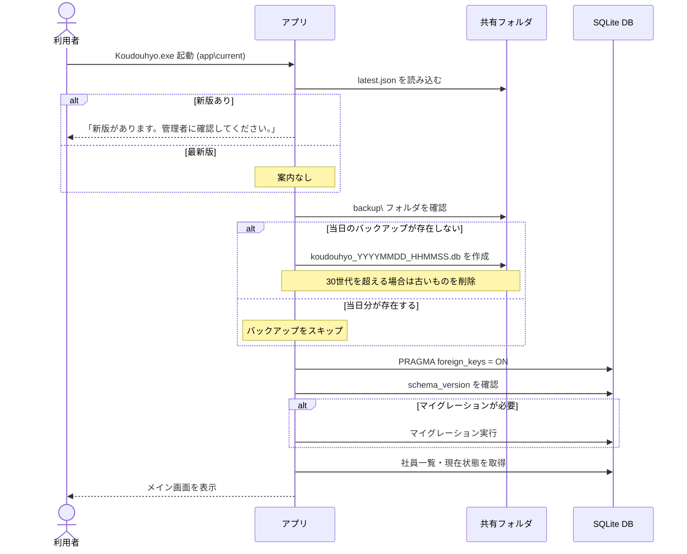
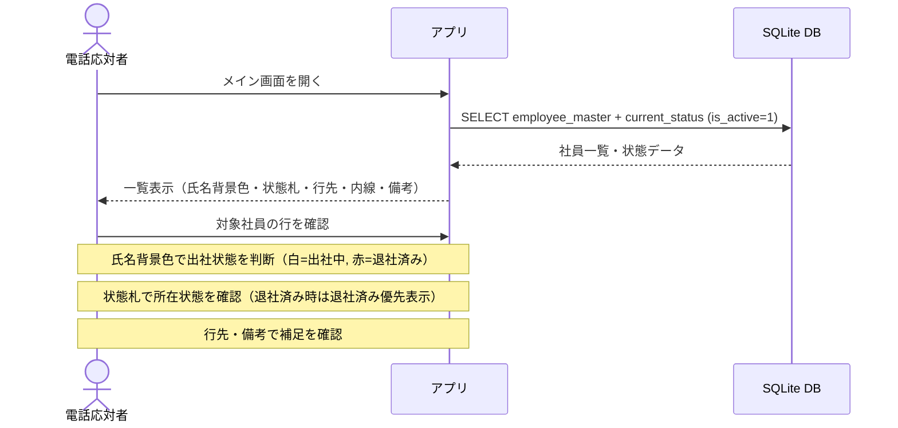
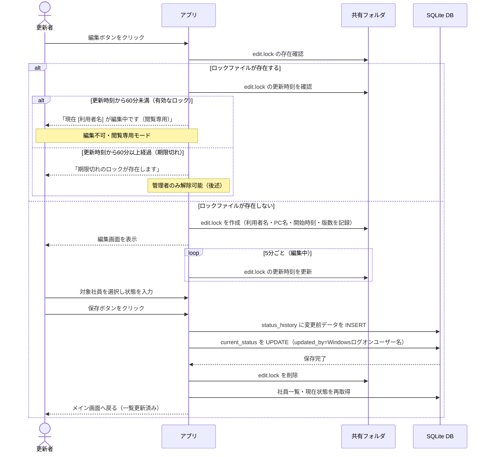
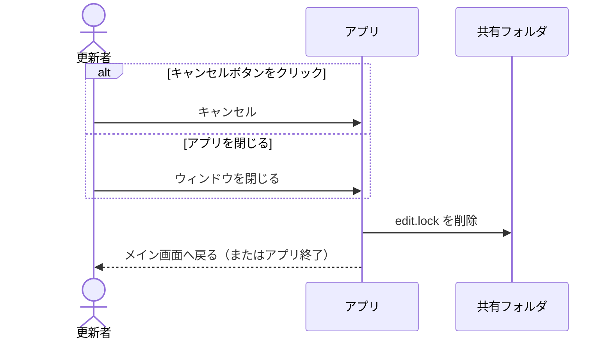
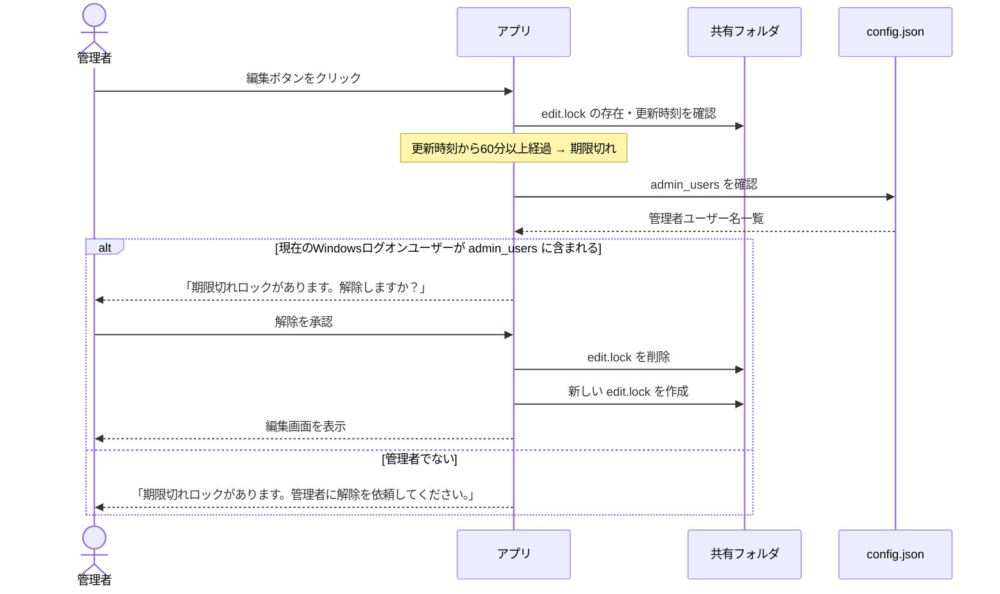
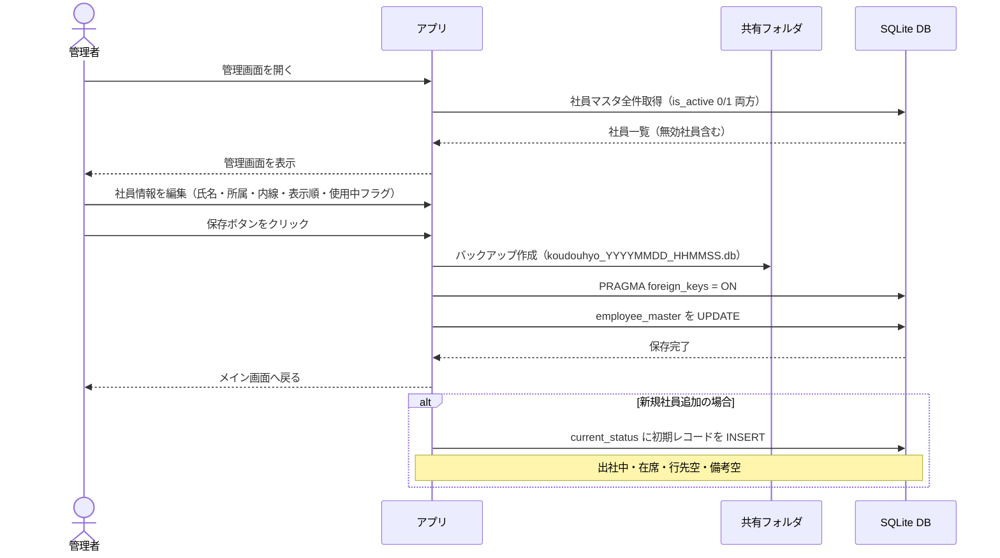
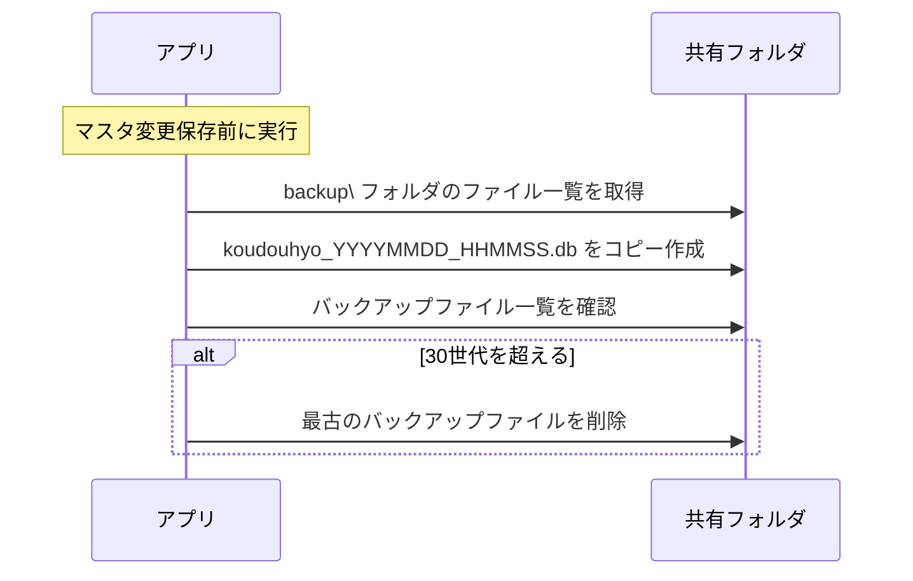
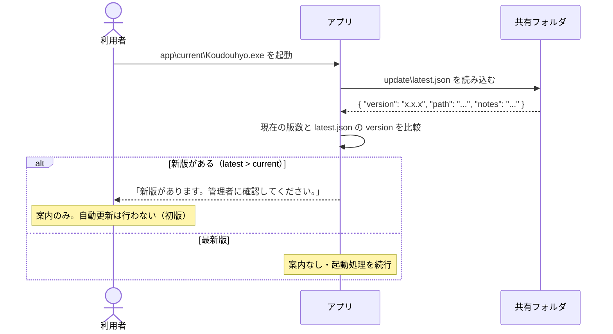

# SEQUENCE.md

# シーケンス図

---

## UC-起動: アプリ起動シーケンス（バージョン確認・バックアップ）

---

## UC-01/02: 社員一覧閲覧（電話応対時）

---

## UC-03/04: 社員の状態を更新する（ロック取得〜保存〜解除）

---

## UC-03: 更新キャンセル・アプリ終了時のロック解除

---

## UC-04: 期限切れロックを管理者が解除する

---

## UC-05: 管理者が社員マスタを変更する

---

## UC-06: バックアップを取得する（マスタ変更前の自動バックアップ）

---

## UC-07: 更新版を確認する（起動時）

